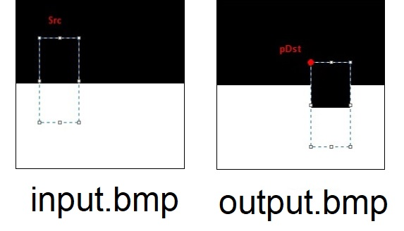

## Overview
Black and white image is encoded using one bit per pixel. The oldest bit in the byte corresponds to the leftmost pixel in the image. The image line is aligned in the file to the nearest multiple of 4 bytes. 
In the black and white image we have following dependencies: 
* Number of bytes containing image pixels = (image width + 7)/8 
* Number of bytes in line (in file) = ( ((image width + 7)/8 + 3)/4 ) * 4  
Information about image memory and important drawing parameters are stored in the `imgInfo` structure: 
```c
struct {  
  int w, h;   // width and height of image  
  unsigned char* pImg; // pointer to the image buffer  
  int cX, cY; // coordinates of current drawing point
} imgInfo;
```  
Additionally the following structures will be useful: 
```c
struct {  
  int left, top; // coordinates of upper left corner of the rectangle  
  int right, bottom;  // coordinates of lower right corner of the rectangle 
} Rect;
```
```c
struct {  
  int x, y; // horizontal and vertical coordinates of the destination point 
} Point;
```  
## Subroutines used
* `move_to` - sets `cX` and `cY` in `imgInf`. 
* `get_pixel` - takes the color of pixel with given coordinates (returns 0 if it’s black, non zero if white) 
* `set_pixel` - sets pixel at given coordinates with color from `imgInf` structure (1 if white, 0 if black), using bit masking. 
* `set_color` - sets color in imgInf structure.  
## Copy rectangle  
```c
imgInfo* CopyRect(imgInfo* pImg, Rect* pSrc, Point* pDst)`;
```
Function takes pointers to image buffer, rectangle's corners and destination point and makes a copy of given rectangle and puts the upper left corner of the source into the destination. 
The copying is done using a nested for loops, looping through the rectangular area of the image buffer, taking each of the pixels from the source and setting the approptiate destination pixels.  
<br>
